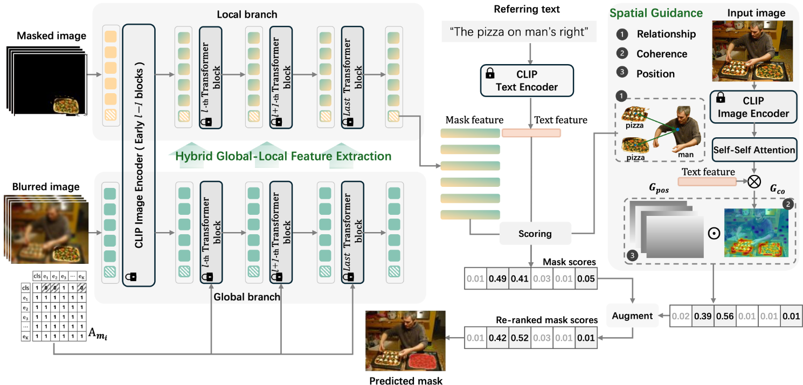

# Hybrid Global-Local Representation with Augmented Spatial Guidance for Zero-Shot Referring Image Segmentation


# Visual Results


# Environment Setup
```
conda env create -f environment.yaml
conda activate hfglris
cd third_parth
cd modified_CLIP
pip install -e .

cd ..
cd segment-anything
pip install -e .
```

# Dataset
we follow [dataset setup](https://github.com/Seonghoon-Yu/Zero-shot-RIS/tree/master/refer) in [Zero-shot-RIS](https://github.com/Seonghoon-Yu/Zero-shot-RIS)
## 1. Download COCO 2014 train images
In "./refer/data/images/mscoco/images" path
```shell
wget http://images.cocodataset.org/zips/train2014.zip
unzip train2014
```

## 2. Download RefCOCO, RefCOCO+, and RefCOCOg annotations 
In "./refer/data" path
```shell
# RefCOCO
wget https://bvisionweb1.cs.unc.edu/licheng/referit/data/refcoco.zip
unzip refcoco.zip

# RefCOCO+
wget https://bvisionweb1.cs.unc.edu/licheng/referit/data/refcoco+.zip
unzip refcoco+.zip

# RefCOCOg
wget https://bvisionweb1.cs.unc.edu/licheng/referit/data/refcocog.zip
unzip refcocog.zip
```

# Run demo
1. Generate GEM attention maps.
```
CUDA_VISIBLE_DEVICES=0 /path2env/bin/python save_attn_gem.py --dataset refcoco(+/g) --split testA/testB/test/val
```
2. Run HF_GL_RIS.
```
CUDA_VISIBLE_DEVICES=0 /path2env/bin/python HF_GL_main.py --dataset refcoco(+/g) --split testA/testB/test/val
```

## Acknowledgement
Our code is based on the following open-source projects: [CLIP](https://github.com/openai/CLIP), [Zero-shot-RIS](https://github.com/Seonghoon-Yu/Zero-shot-RIS), [GEM](https://github.com/WalBouss/GEM). we sincerely thanks to the developers of these resources!

# Citation
```
bibtex
@inproceedings{liu2025hybrid,
  title={Hybrid Global-Local Representation with Augmented Spatial Guidance for Zero-Shot Referring Image Segmentation},
  author={Liu, Ting and Li, Siyuan},
  booktitle={Proceedings of the IEEE/CVF Conference on Computer Vision and Pattern Recognition (CVPR)},
  year={2025},
  pages={1--10}
}
```
